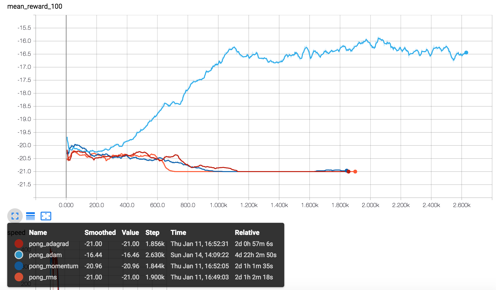

# Deep Successor Representation Network
This repositiory contains the code of my reproduciton of Deep Successor Representation Network in Tensorflow. DSR was proposed [here](https://arxiv.org/abs/1606.02396). My implementation straightly follows this paper.

**For now the network performs really poorly. I am thankfull for all help, information and hints on what I did wrong :)**

## Results
I've tested my implementation with the simple __Atari game Pong__. But the network seems not to be able to learn this game. Tests with different optimizers showed, that __Adam Optimizer__ helped at least a little, but results are still comparably poor:

This diagram shows the mean reward (summed over the entire episode) of the last 100 epsiodes.

I compared to DQN in the same environment setup. DQN was able to achive a mean reward of +18 in round about 3M steps, as expected. So I expected DSR to achieve the same level of play.

## Discussion
See also my questions on [reddit](https://www.reddit.com/r/MachineLearning/comments/7u1m1u/research_reproduction_of_deep_successor/) and [quora](https://www.quora.com/unanswered/What-is-wrong-with-my-DSR-implementation-in-Tensorflow?share=de137857&srid=5i8rf).

